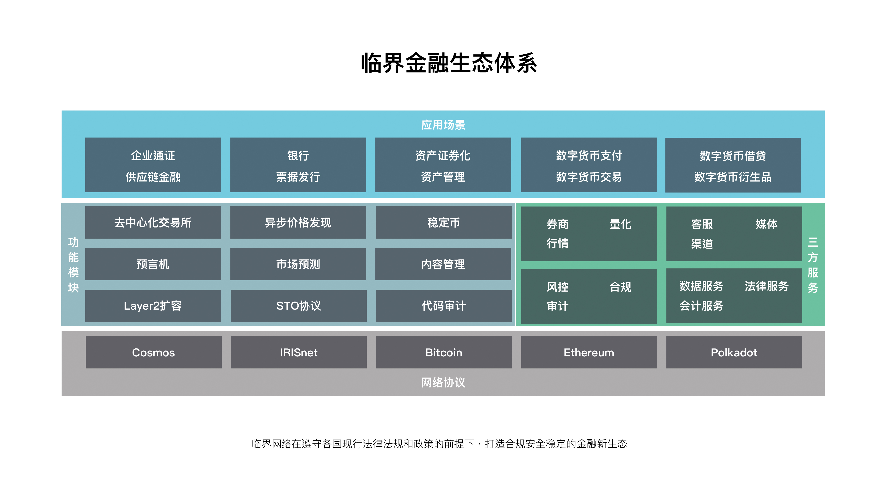

# 临界（Hashgard）   数字金融区块链白皮书


## 新一代数字金融公有链


<center> 2019年3月  <center>
Hashgard Foundation Ltd.           


------


[TOC]


# 第一章  区块链：是社会实验，也是金融革命

## 1.1 区块链技术的发展历史

　　1982年，大卫·乔姆（David Chaum）提出了不可追踪的密码学网络支付系统。1990年，他将此想法扩展为最初的密码学匿名现金系统，即Ecash。

　　1998年，戴伟（Wei Dai）发表论文阐述了一种匿名的、分布式的电子现金系统，他将其命名为b-money。

　　1998年，在戴伟论文发表的同时，尼克·萨博（Nick Szabo）发明了Bit gold，构建出一个产权认证系统。哈尔·芬尼（Hal Finney）则把该机制完善为一种可重复利用的工作量证明。

　　2008年，中本聪在论坛发表了《Bitcoin: A Peer to Peer Electronic Cash System》，首次提出区块链的概念，并在随后由此构建了比特币区块链网络。从2009年被创建至今，比特币区块链网络一直稳定运行，完美实现了数字资产从发行到流通的全过程。与此同时，区块链作为基础底层技术，逐渐衍生出更多应用场景，随之也诞生了更多不同类型的数字货币。

　　2015年，随着以太坊开源项目正式上线，智能合约的概念带给人们更多的想象力。以太坊网络通过一套图灵完备的脚本语言提供了完整的自由度，实现了多种数字资产及智能合约的注册和转移，方便了数字货币的发行和流通，极大程度地丰富了数字货币的使用场景。

　　区块链技术的迅速发展，使得数字货币逐渐走入大众的视线。特别是从2017年初开始，通过ICO这一全新形式，各种项目通证层出不穷，带来了数字货币市场新一轮的繁荣。在2017年底，这股热浪达到高潮，业内外人士纷纷表示区块链技术将成为继移动互联网之后下一个风口浪尖。同时，大量的金融和科技行业的项目、从业者积极拥抱区块链。


## 1.2 区块链对传统金融体系的冲击

　　随着技术的创新与发展，金融服务的业态不断演进。在过去的50年中，电子化的金融数据替代了手工记录，并开启了信用卡时代，终端的普及带来了ATM时代，而互联网和移动互联网浪潮则带来了电子银行和移动支付。

　　今天，区块链的到来，将再一次改变一切。

　　区块链将与包括大数据、AI、云计算、生物学在内的技术一同构建下一代的金融基础设施。而构建在区块链上的新一代的金融基础设施，将能够克服现行金融体系长久以来存在的问题。

1. 传统中心化金融体系中，金融中介成本极高，限制了交易规模。传统金融中介机构在处理交易时，自身需要支出大量费用，同时其还需要谋求高额利润以覆盖可能存在的信用风险。由于成本极高，金融机构在使用传统金融中介服务时，往往会设置最小交易规模，例如最小存款金额、跨境转账最小额度、股票基金交易最小数量等等，这使得大量且高频存在的小微交易无法进行。而区块链被称为信任的机器，作为一种分布式账本技术，不需要第三方中介，能够帮助金融机构省去巨额的中介成本。成本的大大降低，使得点对点之间的小微交易成为可能。

2. 传统中心化金融体系中，欺诈用户的事件时有发生。现行金融体系的大量交易并不是“原子化”的，而是由中介机构承担了担保主体的职责，这也给了交易任意一方恶意违约、欺诈以可乘之机。而区块链是一种分布式的技术，基于区块链的金融系统没有单点欺诈和崩溃的风险。

3. 传统中心化金融体系中，用户隐私数据和资产安全存在隐患。近年来，媒体频繁报道用户隐私数据被大量泄露的案件。目前，海量用户的个人身份、银行账号、交易记录、甚至密码等信息被挂在各类网站上明码标价的售卖，用户隐私和资产安全都受到严重威胁。而在区块链网络中，用户数据并非由中心化系统来保管，而是用户自己保管，真正实现了数据的“民主化”，从而有效保护用户隐私和资产安全。

　　显然，随着区块链技术的不断发展，其分布式账本、智能合约、零知识证明、多方安全计算、同态加密等技术，能够有效的解决当前金融行业内存在的痛点，并可能衍生出新模式、新产品，从而诞生更为智能、有效、安全的金融发展生态。

## 1.3 区块链 + 金融的融合与尝试

　　现阶段，区块链在跨境支付、资产管理、法定数字货币、可信身份、企业内部结算、证券和资产交易等领域都有着广泛的融合与尝试。

### 1.3.1 区块链 + 跨境支付

　　使用区块链进行转账有低费用、实时结算、监管友好、高流动性等便利。加密货币项目瑞波已推出多种应用于银行领域的跨境支付方案，包括：xCurrent- 金融机构的实时结算通道，能够让银行间实现快捷、便利、低成本的端到端跨境转账；XRapid – 基于瑞波币(XPR)的实时结算通道，与普通国际汇款方案相比可节约40%-70%的成本；XVia- 通过网关的实时结算通道，提供了企业间支付的标准化界面产品。
　　2019年1月，瑞波宣布其服务的跨境支付的企业数量已超过200家，包括东京三菱日联银行、瑞穗银行、法国农业信贷银行、瑞典北欧斯安银行、美国运通旗下的外汇国际支付平台、桑坦德银行等，并以每周新增2-3家客户的速度增长。随着瑞波跨境支付交易量的迅速增长，很多专家预测瑞波未来有望取代SWIFT成为跨境支付领域的巨头。

### 1.3.2 区块链 + 资产管理

　　目前，数字资产管理行业方兴未艾，截止2019年2月，全球一共有700个加密基金和100亿美金的管理规模。2018年11月1日，香港证券及期货事务监察委员会（以下简称“证监会”）发布《有关针对虚拟资产投资组合的管理公司、基金分销商及交易平台营运者的监管框架的声明》（以下简称“声明”）已经允许持牌基金公司将其10%以内的资产配置在数字货币市场。全球最大的基金管理之一的富达基金也于2018年成立了一家数字资产托管公司，该公司将7*24小时地提供BTC、ETH及其他加密数字货币的托管解决方案、加密货币交易执行平台和机构建议服务。

### 1.3.3 区块链 + 法定数字货币

　　委内瑞拉总统尼古拉斯·马杜罗在2017年12月3日的电视讲话中宣布了“石油币(Petro)”的诞生。委内瑞拉于2018年2月20号开放预购石油币，成为全球首个自己发行加密货币的国家，首日便卖得7.35亿美元。

　　根据Petro白皮书，委内瑞拉政府预计发行1亿枚、价值约600亿美元的石油币，并将在加密货币交易所上架。委内瑞拉政府将接受以石油币作为缴税、费用、捐款、公共服务手续费的支付方式，且委内瑞拉国营原油公司PDVSA、以及其他国有企业也会参与石油币的销售和购买。

　　马杜罗表示，新货币将得到委内瑞拉储备的石油，汽油，黄金和钻石的支持，石油币将帮助委内瑞拉“在货币主权问题上前进”，而且这将能够为国家提供“新形式的国际融资”。马杜罗希望借由发行加密货币的创举，对抗美国经济制裁，带领国家走出泥淖，摆脱恶性通货膨胀，帮助委内瑞拉摆脱严峻的经济危机，包含还清债务、增加必需品和原物料进口，也能绕过美国政府向委内瑞拉祭出的经济制裁，让美国个人和委内瑞拉企业恢复生意往来。

　　除委内瑞拉之外，多国正加紧研究基于区块链技术发行法定数字货币。如新加坡金管局与德勤共同推出Ubin项目以实现对新加坡元(SGD)进行数字化改造，加拿大央行也推出了基于Jasper的数字货币项目CAD-coin，中国央行成立数字货币研究所组织专家研究法定数字货币，马绍尔群岛将发行自己的加密货币，与美元一起作为法定货币进行流通；随着技术的不断发展，我们相信未来将有越来越多的国家使用区块链技术构建自己的数字货币。

### 1.3.4 区块链 + 可信身份

　　加拿大初创公司SecureKey联合IBM于2018年初，推出基于区块链的全国范围内身份验证系统。新的数字身份系统利用了IBM的区块链技术，让消费者能够通过手机和Windows设备向政府、银行和电信运营商证明自己的身份；允许消费者在访问服务时使用APP来确认其身份的详细信息，如实际年龄或信用评分；网络消费者在申请新的公寓或新款手机时也无需亲自签定文件或提供其他身份证明文件。区块链身份认证系统让消费者能够控制和分享他们的个人信息，而不需要通过集中的系统来创造“价值”的信息，并且这些信息很容易受到黑客的攻击。据悉，多伦多道明银行、加拿大皇家银行以及其他一些大型金融公司已经在该计划中投资了3000万加元（约合2350万美元）。

### 1.3.5 区块链 + 企业通证
　　2019年2月，美国最大的商业银行摩根大通宣布计划在自己的私链平台Quorum上发行自有数字货币JPMCoin。JPMCoin以1：1的比例与美元挂钩，该机构将利用其强大的资金储备来保证该通证的稳定性。JPMCoin为企业间的资金流动而设计，早期应用主要体现在大型企业客户的跨境支付、证券交易、取代美元。但目前还只是一个模型，仅有少量机构客户参与测试。与此同时，另一个互联网巨头Facebook也悄然布局加密货币。

### 1.3.6 区块链 + 资产交易
　　2018年12月，美国纽约证券交易所(NYSE)的母公司洲际交易所(ICE)创立的数字资产交易平台Bakkt宣布完成了首轮融资，从12名合作伙伴与投资者中筹集了1.83亿美元的资金。

　　Bakkt一定程度上是利用ICE的交易基础设施，为比特币期货交易能够被更广泛接受提供新的基础设施：包括该行业的第一个机构级别的受监管的交易平台和提供实物交付和存储的清算和储蓄服务。

　　芝加哥期权交易所(Chicago Board Options Exchange)和芝加哥商品交易所(Chicago Mercantile Exchange)都在交易比特币期货合约，这些合约不是通过交割实际的加密货币，它们是根据比特币价格的变动以现金结算的。因此，实际上，它们是一种押注加密货币未来价格的工具。而Bakkt实行的是实物交割，且没有保证金交易。

　　Bakkt正在建立一个开放、无缝的全球网络，使用户能够简单、安全和有效地购买、销售、存储和使用数字资产。Bakkt还希望通过让消费者从刷信用卡转向扫描他们的比特币APP，利用比特币简化和颠覆零售支付业。市场机会是巨大的，全世界的消费者每年要支付高达25万亿美元的信用卡或网上购物费用。

　　《财富》杂志也表示，“ICE进军加密货币交易领域可是件大事。它可是金融产业中历史悠久、受人尊重、力量极为强大的机构参与者。"

### 1.3.7 区块链 + 证券通证

　　关于证券类通证，目前尚没有明确的定义，但根据业内的普遍理解，可以简单定义为符合监管的资产通证化(Tokenization)，这个定义主要包含两点：

1. 通证的发行和交易需要符合政府相关机构的监管；

2. 各类资产（有形和无形资产）在区块链上以通证的形式流转。

　　监管是证券类通证的重点。以在美国发行证券类通证为例，证券类通证需要接受SEC及其他相关机构的监管，发行证券类通证的主体也将受到联邦法律的约束，通常而言，证券类通证还需要在SEC注册（满足特定条款而豁免的除外，如Reg A+, Reg D, Reg S等），并需遵守证券法的种种规定。监管行为将推高证券类通证的发行和交易成本以及参与门槛。

　　虽然监管带来的发行成本有所上升，但证券类通证的优势十分明显：

1. 降低投资和交易门槛：比如一幢价值不菲的写字楼可以使用证券化通证拆分成理论上无限小的单位，大大降低投资门槛，任何普通人都可参与。

2. 增强资产流动性：比如一个封闭期为10年的私募基金，投资人只能在10年后才能收回自己的投资，但如果将基金通证化，那么投资人可以随时买卖基金份额，实现资产的流动。

3. 更低的发行成本：传统的IPO发行费用和时间成本极高，站到募资额的4-7%。而采用STOs的方式，成本将大大降低。

4. 降低监管摩擦成本：通过监管程序化的方式，降低监管成本与难度，打破监管机构之间、国家之间的壁垒，使资产在不同国家和地区之间的交易更加便捷。

5. 提高市场效率：因为这些通证可以在世界范围内销售和交易（只要符合规定），资产的定价将更加公平，价格发现机制更有效率，因此对投资人具有吸引力。

6. 扩大中小企业融资渠道：仅在美国，每年就创建了超过65万家公司，但是华尔街，硅谷和天使投资者没有为创业公司提供足够的资金。因此，受监管且符合要求的证券类通证发行或STO(Security Token Offering)可以帮助中小型企业获得新的融资渠道。

------

 

# 第二章  临界的产生背景与设计目标


## 2.1 临界的产生背景
​　　临界(Hashgard)项目正式启动于2018年3月，但团队主要成员对于区块链技术的探索与研究最早可以追溯至2013年，参与的形式包括：对区块链网络架构与开源代码的技术研究、基于以太坊的智能合约开发与验证、多个优秀区块链项目的早期构思与孵化、区块链数字资产基金(Token Fund)的设立与管理等等。

　　在长期的研究中，临界团队逐步发现，现有的区块链公链体系无法满足金融行业的使用，其原因包括：

1. 多数公链的性能难以达到金融系统的要求，例如比特币每秒仅能处理七笔交易，以太坊也只有几十笔交易，远远不能满足金融系统的并发量需求；

2. 多数公链的使用门槛较高，用户友好度亟待改善，例如以太坊的智能合约需要使用Solidity语言编写，EOS的智能合约则需要使用C/C++语言编写，对于绝大多数用户来说，这些语言难以学习与掌握；

3. 多数公链缺少跨链能力与灵活的扩展机制，与其他公链通证的交互能力差，且无法支持引入组件化功能模块；

4. 多数公链过于自由，不受监管的约束，而金融行业本身是强监管属性，实现大规模商用的同时，需要考虑监管节点以及监督性质的观察者节点。

## 2.2 临界的设计目标
​　　致力于打造一条更适用于未来金融行业的区块链网络，从而助力更多分布式金融产品与商业应用的产生与发展。我们认为未来的金融区块链应当具备如下特性:
1. 满足金融级别的交易能力；

2. 支持企业通证的发行；

3. 拥有更为灵活的扩展性； 

4. 支持与其他区块链的跨链交互；

5. 监管友好，满足金融监管的需求。 

## 2.3 临界网络的应用场景
​　　从设计上，支持传统金融业务与通证业务的应用。

### 2.3.1 传统金融业务的应用

#### 2.3.1.1 金融资产的确权、上链


​　　临界网络赋能金融资产，包括股权、债权、收益权等等，使其登记、交易、结算等环节都能够直接在链上完成，链下的合规机构按照链上的记录进行结算交割，这将极大地增强金融资产的流动性。


#### 2.3.1.2 债券、票据产品的发行 

#### 2.3.1.3 供应链金融应用 

​　　临界网络通过将金融体系中的商票、银票上链，在技术上支持供应链金融的多主体合作、多层级信用传递、资产数字化、流程智能化等场景特征。

#### 2.3.1.4 金融衍生品的发行 

​　　临界网络支持各类金融衍生品的上链发行，包括基于传统金融资产和数字资产的远期、期货、期权和掉期合约等。

### 2.3.2 通证业务的应用

#### 2.3.2.1 企业通证发行

​　　企业可以使用临界网络发行通证，该通证可以：

1. 作为企业生态里的积分，支持企业的内外部运营；
2. 作为企业的股权持有凭证，持有者享受股息；
3. 作为企业发行的债券持有凭证，到期后企业还本付息。   

#### 2.3.2.2 分期释放

​　　在大多数情况下，投资者购买的企业通证需要分批释放、逐步流通。例如ABCCoin通证的发放分为十期，每月释放10%，以以太坊ERC20通证为例，发行方通常会采用两种方式：

1. 发行方通过人工的方式，分期转账，这种方式带来的弊端是依赖于中心化的转账方式，存在极大的违约风险，购买方有可能无法按期收到通证；

2. 发行方部署智能合约，将待释放通证转入合约地址，通过合约代码实现到达指定时间后分批释放后续通证，这种方式避免了中心化系统可能出现的违约问题，但同时，投资者也只能等待通证的按期交付，无法将未来拥有的通证提前流通。

​　　基于临界网络的通证发行协议与远期支付协议，能够很好的解决上述问题。发行方通过通证发行协议生成ABCCoin通证，随后通过远期支付协议创建出多批远期通证，并与购买方进行交易。远期通证在到期前可拆分可流通，同时远期通证在到期时自动转换为即期通证ABCCoin，在确保无违约风险的同时，又提高了流通性。

#### 2.3.2.3 锁仓计划

​　　通证发行方通常使用锁仓的方式来降低流通性，激励用户持币，刺激通证的市场价格的上涨。目前多数通证使用中心化交易所或钱包进行锁仓，即通证发行方与中心化的第三方平台合作，用户将自己持有的通证锁定在第三方平台账户中，锁定期限结束后获取锁仓奖励。这种中心化的锁仓方式对于发行方与用户而言都不安全，同样存在着第三方平台违约或者被盗的风险。
​　
​　　基于临界网络的存款与远期支付协议，能够给予用户更好的去中心化锁仓体验。通证发行方创建定期存款盒子，同时设置锁仓规则，放入锁仓奖励。通证的持有者可以根据要求将自己的通证装入盒子，并获得相应凭证，到期后用户将获得相应的本金与奖励，从而实现去中心化的锁仓计划。

#### 2.3.2.4 锚定法币的稳定币

​　　目前多数稳定币使用基于比特币的扩展信息或者基于以太坊的ERC20协议来发行锚定法币的稳定币，并依据链下的机构提供稳定币与法币的等量兑换，例如Tether公司发行的USDT，PAXOS公司所发行的PAX等等。锚定法定的稳定币极大的便利了链上资产的定价与支付，向用户提供了良好的交易体验。然后这些稳定币仍然存在如下问题：

1. 由于稳定币是基于比特币或者以太坊网络的，对于稳定币用户来说，除了拥有稳定币之外，还需要持有BTC或ETH才能进行支付区块链网络上的交易费用，对于大多数普通用户来说感到困惑与不便；
2. 我们把稳定币类比为银行的法币的话，用户在钱包持有稳定币并不能获得类似银行向用户提供的活期利息，这是因为区块链网络的处理能力有限，稳定币的发行方无法向用户进行每日派息；
3. 用户所持有的稳定币仅能在一个网络进行支付，无法跨链使用，例如用户持有基于比特币的USDT，无法购买以太坊上使用ERC20版本USDT定价的商品或服务。
   
    针对以上痛点，临界网络提供了更好的锚定法币的稳定币发行方案
1. 临界网络的手续费支付方式是非常灵活的，可以通过链上提案与投票治理的方式增加更多币种作为手续费的可选种类。即使稳定币的用户不持有临界网络的主币种，也可以通过使用稳定币支持交易费用来正常的开展业务；
2. 临界网络提供了系统原生的分红协议，通过“一次派息，异步取回”的方式允许稳定币的发行方向持有者支付分红或活期利息，在不增加网络负担的情况下，提升了用户的体验；
3. 网络原生支持跨链，稳定币的用户后续可以直接通过跨链的方式在其他网络使用。

#### 2.3.2.5 去中心化交易所

​　　临界网络提供原生性的原子交换协议，卖方可以将自己所持有的通证资产按指定价格在链上挂单，买方可以以相应的价格提交吃单，一旦双方的买卖需求匹配成功，链上将完成买卖双方的通证资产互换。

​　　基于原子交换协议，开发者还可以很容易的开发出一套对用户而言体验更加友好的去中心化交易所，将用户挂单放在中心化系统以节省手续费用，交易所运营方为用户做买卖单的撮合，而将交割的过程通过链上原子交换协议来实现以确保交易的真实与透明。   

#### 2.3.2.6 去中心化基金

​　　临界网络支持去中心化的数字资产投资基金的创建，基金经理可以发行通证作为持有基金份额的凭证，基金所持有的资产可以通过原子交换的方式进行链上交易。临界网络的生态系统也可以为去中心化基金提供基于hService协议的一系列链外管理工具，如净值计算、基金会计、交易结算、业绩计算、管理费和carry的计提等。基于临界网络，基金的管理人可以很低成本地建立和管理基金，同时降低对手方信用的风险，这种基金既可以是开放式或封闭式的，也可以是主动型和被动型的。　

------


# 第三章  临界网络概述

## 3.1 技术基础

　　临界网络基于 Cosmos-SDK 开发。Cosmos-SDK 是使用 Golang 语言编写的、网络层和共识层使用 Tendermint 的开源框架，它被设计成能让开发者在 Cosmos 网络上轻松创建定制化的，可相互操作的区块链应用程序。Cosmos SDK 同时兼顾安全与灵活两项特性，广泛使用了“Object-Capability Model”（对象能力模型）与“Principle of Least Privilege”（最小权限原则）。Cosmos SDK建立起了两条管理规则：

1. 只有在对象A与对象B相关的情况下，对象A才可以给对象B发送消息；

2. 如果对象A收到了一条包含关联到对象C的消息，对象A就关联到了对象C。

　　作为这两条规则的结果，只有通过一条已有的关联链条，一个对象可以关联到另一个对象。简而言之，“只有连通才能产生连通”。    

　　Cosmos网络由不同的独立、平行区块链组成，其中的每条区块链都通过 Tendermint 这样的经典拜占庭容错共识运行。Cosmos上的区块链称为“分区(zone)”。其中的一些分区又称为“枢纽(Hub)”，不同的分区可以通过共享的枢纽来互相通信。

　　Cosmos Hub 是第一个在 Cosmos 网络里的枢纽(Hub)，主要用于跨链访问（如转账、服务调用等），如果区块链通过 IBC 协议连接到枢纽，将会自动获得到其他连接至枢纽的区块链的访问能力。所有跨分区的通证转移都需要通过Cosmos Hub进行，因此通证可以安全、迅速地在分区之间转移。分区之间无需具有直接的汇兑流动性，而只需通过Cosmos Hub来追踪记录每个分区持有的通证总量，并确保所有分区的通证总量不变。Cosmos Hub起到了一种类似中央银行结算功能的作用。

　　IRIS Hub是另一个在Cosmos Network里的枢纽，IRIS设计了新的语义，允许通过IBC调用跨链计算资源，同时集成了分布式文件系统IPFS，这对商业应用尤为重要。

　　Ethermint 提供了 EVM 的模块，允许用户在 Tendermint 的 PBFT 共识之上运行智能合约。

### 3.1.1 网络架构


　　如图所示，临界网络在设计上具有与Cosmos、IRIS相似的拓扑结构，临界网络是基于Cosmos所开发的，专为金融行业所服务的区块链分区(zone)，并在Cosmos SDK基础之上开发出了令人耳目一新的临界金融服务能力框架，传统金融企业可以在无须知晓与了解区块链底层技术的情况下，快速将自己的业务迁移到区块链世界里面来，实现快速开发与部署，并创造出全新的业务应用场景。对于安全性与可靠性有极高要求的金融企业，也可以直接使用临界网络与发行包构建和部署自己的独立链，来运行自己的应用。

　　临界金融服务能力框架里面包括三类服务：

1. 系统原生服务，指内置于临界网络之中，由区块链底层代码提供的服务，例如转账、多签、存证、抵押、委托投票、通证发行协议、原子交换协议等等。

2. 智能合约服务，指通过智能合约形式部署于临界网络之上，通过编写智能合约向用户提供的服务，例如证券类通证协议、异步价格发现协议等等。临界网络后续将通过集成虚拟机的方式向用户提供智能合约服务。

3. 外部接口服务，指通过hService协议向临界网络提供服务的外部服务提供商，服务商与用户通过Input/Output消息的方式进行交互，例如数据提供商向用户提供的实时金融数据服务，或者审计机构对企业用户提供的审计报告服务。

### 3.1.2 共识机制

　　与Cosmos 网络里的其他网络一样，临界网络采用 Tendermint 作为共识层。Castro 和 Liskov 在1999年引入的实用拜占庭容错(PBFT)算法后，Tendermint 是 Jae Know 创建的第一个 PoS 改编版。

　　Tendermint 伪随机的安排一个验证节点在多轮投票的过程中提议一个区块。但是，提交和最终化区块取决于大多数——所有验证节点所持有股权中超过2/3股权的验证节点在提交的区块中签名。在区块最终化之前可能需要进行几轮签名。BFT系统可以容忍1/3的失败，其中失败包括故障或是恶意的攻击。

　　Tendermint主要包含两个主要的技术：区块链共识引擎和通用的应用接口。共识引擎被称为Tendermint核心模块，确保相同的交易在每个机器中都按照相同的顺序被记录下来。应用接口被称 ABCI(Application BlockChain Interface) 让交易可以被任何编程语言编写的程序处理。

　　在核心模块中，Tendermint基于循环投票机制进行工作，这也是共识协议的原理。一个回合被分成3个处理步骤：验证者提议一个区块、发送提交意图、签名后提交一个新区块。这种机制为原子广播提供了一个安全的状态复制机，增加了一个责任层——安全故障可以完全归结于Tendermint。

　　Tendermint共识算法从验证节点集开始。验证节点们都维护了一份区块链的全拷贝，并且可以用公钥来识别验证者的身份。在每个新的块高度他们轮流的提议一个区块。每轮投票都只有一个验证节点可以提议区块，并且要用相应的私钥对此进行签名，这样的话如果有错误发生就可以找到为此负责的验证节点。然后剩下的验证节点就需要对提议进行投票，投票使用自己的私钥进行签名。这些组成一个回合。不过可能因为网络的异步需要几个回合才能提交一个新块。

 

　　验证节点提交块的时候由于几种原因可能会失败：当前的提议可能下线了，或者网络可能遇到了延迟。Tendermint允许验证节点可以被跳过（就是轮到一个验证者提议区块的时候但是此验证节点没有提议）。验证节点在移到下一轮投票之前等待一小段时间来接收提议人（此轮提议出块的验证节点）提议的整个区块。这种对超时的依赖让Tendermint成为一个弱同步协议，而不是一个异步协议。不过，剩下的协议是异步的，并且验证节点只有在接收到了超过2/3的验证节点消息时才会进行处理事物。正是因为这样，所以Tendermint需要大多数的验证节点可以100%正常运行，如果1/3或更多的验证节点离线或脱机，网络就会停止运行。

　　假设少于1/3的验证节点是拜占庭，Tendermint保证安全永远不会被破坏——也就是说，验证节点（2/3以上）永远不会在同一个高度提交冲突的区块。因此，基于Temdermint的区块链永远不会分叉。


### 3.1.3 跨链交互

　　跨链交互是我们期望在临界网络上实现的重要功能，跨链交互使得同质化通证与非同质化通证的不同链之间的无缝转移与使用成为可能。临界网络计划采用Cosmos的IBC(Inter Blockchain Communication)协议实现与不同主链之间的跨链交互。但需要注意的是，IBC协议只能对转入和转出区块链都具有最终性时才能够使用，但比特币并不具有最终性保证，以太坊将来演进到Casper之后才会有最终性保证。

## 3.2 系统原生服务

### 3.2.1 转账

　　在临界网络中，用户通过对若干通证转移给另一用户这个行为，进行随机散列的数字签名的签署，以证明此次行为是用户本人发起，这个行为即为支付。通过对签名进行检验，就能够验证此行为是用户本人发起的。验证结果为真且结果入链，则会在链上留下记录。此交易记录不可被否认，不可被删除，不可被篡改。

### 3.2.2 多签

　　允许两个以上的用户作为一个整体，对消息主体进行数字签名作为授权，这种特定类型的数字签名方式即为多重签名。也就是说，多重签名是通过多个单一签名的组合来完成的。临界网络内置多签账户类型，多签账户包含由若干个普通账户构成，并可设定普通账户的签名权重和多重签名的操作阈值。引入多重签名机制，可以实现分散风险、提高安全性等。

### 3.2.3 存证

　　在区块链上存放数据是有成本的，而且区块链的技术特性决定了在上面锚定数据体量不可能太大，因此，存证机构当然不会把全部的存证数据都入链，而是将存证数据进行摘要计算得到数字指纹，通过Merkle Tree算法来计算获得Hash值，进一步降低数据体量，最后将Hash写入链中，相当于将数据存证于一笔不可篡改的交易中，从而完成了存证的过程。这个过程我们称为锚定，其实是将存证链条锚定到了区块链上。基于区块链的存证很好的利用了区块链网络的强大算力以增强公信力，让电子数据可证明，可追溯，可信赖。

### 3.2.4 抵押

　　临界允许没有能力搭建验证节点的用户将通证委托给活跃验证节点，以分享活跃验证节点的出块奖励并参与社区治理。

　　赎回通证操作需要在行为发起后锁定一段时间才能释放并自由流通。如果委托人发现活跃验证节点出现不稳定等影响资产安全的隐患，可将通证无延迟切换到其他活跃验证节点。


### 3.2.5 提案与投票

　　临界网络通过分布式组织来运行，这类组织要求有一套完备的管理机制，从而协调区块链上的各类活动。临界网络支持三种提案类型：文本、参数变更、软件升级。提案与投票过程如下：

1. 创建提案 SubmitProposal

2. 抵押通证 Deposit（足量抵押后进入Voting阶段）

3. 投票 Vote

　　所有活跃验证节点都要对提案的投票负责。如果某个活跃验证节点没能及时对提案做出投票，那么该节点就会在一段时间内自动失去活动权利，这段时间叫做缺席惩罚期（AbsenteeismPenaltyPeriod，默认为一周）。

　　委托人自动继承委托活跃验证节点的投票权，如与所委托的活跃验证节点持有不同意见，可单独投票覆盖被投票代表部分的权重。未绑定委托验证节点的通证是没有投票权重的。

　　任何用户均可以发起提案，每个提案都需要一定数量GARD通证作为保证金，即最低提案保证金（MinimumProposalDeposit），以防止恶意用户发起垃圾提案攻击网络。

　　用户对提案的投票意见有四种“同意”、“反对”、“弃权”、“强烈反对”。记票时只会计算活跃验证节点的投票以及委托给活跃验证节点的用户投票，如果投票率低于最低百分比，投票结果为“失败”，系统将惩罚未投票的验证节点。如果超过1/2的投票为“同意”则结果为“成功”，但如果有超过1/3的投票结果为“强烈反对”则提案失败。


### 3.2.6 同质化通证发行协议（HRC10）

　　临界网络支持效用类同质化通证（Utility Token）的发行，与用户所熟知的以太坊ERC20通证功能类似，但有如下特点：

1. 从区块链底层支持通证发行，而并非使用智能合约。用户不需要了解solidity或者其他编程语言，只需要调用系统提供的标准化接口，便可以以十分简便的方式部署通证。从以太坊通证智能合约所出现的诸多安全漏洞问题来看，我们意识到，让用户使用智能合约是一件具有极高安全风险的事情，对于较为标准化的功能组件而言，应该尽量减少用户的编程，能够有助于降低风险；

2. 通证的创建者被称为通证的owner，该用户拥有对通证的所有权，可以对通证的可选项进行修改及配置。


### 3.2.7 原子交换协议（HRC11）

　　原子交换协议是可以在点对点的基础上实现两种或两种以上加密货币的交换的协议，交易任意一方无需信任他们的交易对手，也不需要通过可信的第三方进行调解。

　　在原子交换协议出现之前，普遍的中心化的交易协议（如交易所，金融服务机构）存在着基于信息的交易模式固有的弱点：

1. 将更多的成本转嫁给用户

2. 充当系统的单点故障

　　同时，这种模式要求各方依赖机构为交易提供便利，并在发生纠纷时逆转交易。由于缺乏交易终局性，对信任扩展的需求和交易相关方将继承中介的成本。

　　在临界网络中，从系统底层提供原子交换协议，任何用户可以在无须信任对方，甚至无须知晓对方的条件下发起一笔交易，用自己的一项通证去交换对方的另一笔通证，这笔交易要么成功，要么失败，不会出现付出自己的资产，而没有收到对方资产导致损失的情况。

　　原子交换协议允许两个或多个参与方对等地交换加密货币，而无需将信任扩展到第三方仲裁机构。通过程序性托管，它们将对可信第三方的需求和调解成本降到最低。用户及其交易对手可以使用原子交换来避免支付不必要的费用，并将交易对手、结算和托管风险降到最低。

　　原子交换协议证明了通过非中介化和可编程货币革命可以实现：

1. 用户拥有并部署自己的金融服务程序（无需可信第三方）

2. 用户在交易过程中拥有资产完全的控制权（去中心化）

3. 加强区块链网络中通证的P2P流动性（交易成本降低）


### 3.2.8 存款与远期支付协议（HRC12）

​　　在临界网络中，用户（称之为盒子的owner）可以创建一种“存款盒子”（DespositBox），存款盒子的作用类似于银行的定期存款服务，其他用户（称之为盒子的投资人“investor”）将指定类型、限定数量的通证装入盒子，可获得一份凭证，持有该凭证的投资人可以在存款到期时，获得本金与相应的利息。

　　例如：盒子的owner  A创建盒子Box1，指定通证类型ABC，最大数量为1万，日利率是0.1%，存款期限为10日，则owner A在创建Box1后，需要存入1万\*0.1%\*10=100ABC以激活盒子。investor 用户B向Box1存入500枚ABC之后，将获得一份凭证（名为ABC-1），持有该凭证到期后，系统将自动将investor B账户里的凭证兑换为505ABC（本金500ABC，利息5ABC）。

　　FutureBox 是一种系统原生的特殊存款盒子，可以被看作是零利息、不限定通证类型、不限定通证数量、没有到期时间、永不销毁的存款盒子。用户在向FutureBox 中存入自己所持有的通证（我们称之为“即期通证”）并指定到期时间后，可获得一份可拆分且可转让的凭证（我们称之为“远期通证”），到期后，系统将自动为用户将远期通证兑换为1:1的即期通证。远期通证可以被使用于债券、支票、期货等应用场景。

​　　用户若在向FutureBox存入即期通证时选择转换为“不可拆分、不可转让”的远期通证，实质上等同于锁仓服务。

### 3.2.9 分红协议（HRC13）


​　　在临界网络中，提供系统原生的具有分红功能的盒子（BonusBox），允许在某区块高度时进行快照，并向持有某类通证的用户按比例分红。

　　该功能可以用于：

　　（1）向用户空投新币种；

　　（2）同一币种进行分红；

　　（3）公司向股东分配股息；

　　（4）类似余额宝的功能，给用户活期利息；

　　例如，ABC通证总发行量为1亿枚，DEF的发行方（称为distributor）希望在12月1日0点对所有持有ABC通证的用户按100：1进行空投，则DEF的发行方需要在12月1日0点前将100万枚DEF通证放入分红盒子并完成设定，12月1日系统自动进行快照记录每个用户的ABC持有量，并将可获得的相应的DEF通证数额通过钱包中提示给用户。用户点击“获取”按钮即可获取分红。

### 3.3.10 别名服务协议（HRC14）

　　在区块链世界里面，钱包地址中夹杂着没有规则的字母与数字，十分晦涩难懂，为了方便传统金融企业用户将业务迁移至临界网络，我们在系统原生的集成了别名服务协议，以简化用户的支付，并可衍生出更多的业务场景。

　　临界网络，账户别名指的是一连串的字母与数字，账户别名最短为8位，最长不超过20位，例如“charelie1234”、“taalic5566”，8位以下的别名系统保留以待后续扩展。

　　任何用户均可以向系统付费，以购买一个自己喜欢的账户别名，并将其指向到另一个地址，同时，用户还可以将自己的账户别名转让给其他用户。别名一旦完成指向，用户即可以使用别名在系统中进行支付。例如，当用户将“taalic5566”别名指向到gardABCDEFGHIJKLMNOPQRSK地址，后续任何用户支付时只需要使用“taalic5566”即可发放给用户在主网中的地址。

## 3.3 外部接口服务

　　临界网络未来将实现hService接口，外部服务提供商可以通过hService标准协议向临界网络的用户提供服务，hService协议本身并不限定提供商是否以去中心化的方式实现，只要提供商监听与处理传入的请求消息，并将结果发送回临界网络即可。提供商可以为他们的服务自行定价。

　　临界基金会未来将维护一套用于所有hService外部服务提供商的概要文件，通过这些概要文件，用户可以选择他们认为合适的提供商。

　　外部服务提供商应当以临界网络GARD通证作为定价的计量单位。

## 3.4 智能合约服务

　　临界网络未来将通过集成虚拟机来向用户提供基于智能合约服务。偏好使用智能合约的开发人员可以通过编写智能合约来向用户提供服务。

## 3.5 经济模型


### 3.5.1 基本思想

　　对未来分布式商业世界的理解里面，我们认为通证代表着资本或资源的使用权而非所有权，然而这两者有何区别，是我们一直在努力思考的问题。

　　在总量恒定的单通证模型中，通证的经济效用是双重的：抵押和交易。由于更多的场景集中在这一通证上，使得通证引入了更多的流动性，但与此同时，人们抵押他们的通证所获得的激励更少了。最大的问题是，这种更大的流动性会使网络安全性变弱，允许潜在攻击者暗中汇集攻击权益证明系统所必要的通证数量。

　　例如，假设某用户拥有通证总发行量供给的5%，同时如果少于总发行量的15%被抵押，该用户便可以单凭一己之力向网络发动33%攻击（拜占庭容错的上限）。这种情景并不是不可能发生，因为在单通证模型下，通证流通中的效用比抵押保证金更加宽泛。所以很不幸，虽然用户可能是无心之举，但本质上单通证模型放大整个网络的安全风险。

　　和单通证模型正好相反，如果PoS/DPoS的主网划分出专门来从事某些类功能的通证，会隔离开不同通证所代表的功能区间。权益类通证单用来抵押，功能类通证用来交易，通过生态系统将二者有机的结合起来。这样，对整个网络可能发起的攻击从理论上会被缩小，由于权益通证的流动性变差，其价格升高，导致用户想发起33%攻击的代价变得更高。

　　此外，资本与物理资源，在多种特性方面有着本质的区别：

　　首先，资本是具有非消耗性的属性，而资源具有消耗性的属性，比如，当用户甲将100元以现金方式或者网络转账付用户乙的时候，整体的资本总量都没有减少，但是以网络方式转账的时候，消耗了服务器和网络带宽，尽管这个数量微乎其微。对于资本，除非人们主动销毁（类似于注销股份），它并不会变少，但是物理资源，人们时时刻刻都在“真实的”消耗它。

　　其二，资本的增加对于发行者来说成本是微乎其微，或者接近于没有成本，例如央行印钞票增发货币，例如公司增发新的股份。但是物理资源的增加需要现实的付出，例如带宽不够用了，需要接入新的光纤，例如CPU跑满了，需要新的服务器。这两者同样的增大了供应量，但是增加成本完全不同。

　　其三，资本的定价是极其主观的，价格受交易情绪的影响极大，例如股价的波动尽管有可分配利润的锚定，依然波动剧烈，甚至会因为毫无逻辑的利好关系而大涨，例如特朗普当选总统时一支名为“川大智胜”的股票大幅上涨，例如《欢乐颂》电视剧热播时，跟剧情中被老谭收购公司名称类似的“红星发展”股票连续三个涨停，对于没有大部分没有真实资产支撑的加密货币来说更是如此。但是物理资源的定价在大多数情况下客观的，因为用户购买的用途是使用（价格波动也仍受因供求关系的影响）。

　　其四，对于资本，我们期望用户更多的是持有，减少流通以获得增值，但对于使用费，我们期望用户更多的去使用。

　　基于以上原因，我们认为对于使用PoS/DPoS的公链来说，其未来发展趋势是将代表资本的权益类通证，与代表物理资源的功能类通证分开设计，最终实现 “多通证体系”。 

### 3.5.2 设计目标

　　权益类通证的核心效用是作为保护主网区块链共识安全的一个工具，且其基本效用并不来源于作为一种货币用来支付手续费。故权益类通证应该有一个比较低的流通速度和流通性。另一方面，权益类通证还可以被视为虚拟硬件的一部分，就像工作量证明中的ASIC设备（专用计算设备），得到它是为了让一个实体可以作为网络的维护者参与进来。验证者应该受到强烈的激励将他们的权益类通证作为保证金长期抵押；由于他们为整个网络提供共识和更大的安全性，他们也将因此获得奖励。

　　燃料类通证是一种次级的功能类通证，其核心效用应当用于交易；所以其应当具有更强的流通性，流动速度必定更高。

　　经过研究我们确定，这就是我们朝向一种精心设计的、安全的权益证明网络前进的一种方式。

　　我们期望临界网络的经济模型实现如下几点：

1. 对于维持网络稳定的验证节点，能够获取相应的记账收益；

2. 对于大规模使用网络的应用方，能够有预估、并且相对稳定的开发与运营成本；

3. 对于普通用户，我们希望网络活跃用户可以零成本或少成本的使用网络，同时也希望能够刺激“沉睡用户”的使用欲望；

4. 对于公链开源代码的贡献者与服务开发者，我们希望其能够获得持续的激励；

　　另外，区块链的使用成本往往与通证价值、链上交易活跃度直接挂钩。一方面，通证价值通常会随着区块链网络使用量增加而上升，另一方面，在区块链网络流量激增时，使用成本也会显著提高。这还没有考虑二级市场交易行为对于使用成本的影响。对于任一商业模式而言，不可控的运营成本都是无法接受的。

　　因此，我们设计经济模型的目标是维系使用/交易成本尽可能少受到价格/交易活跃度波动的直接影响，从而使临界网络更好地满足项目方和普通用户的使用需求。

　　临界网络主网上线初期，可预见的网络交易密度不高，交易手续费暂时不会产生爆发式增长；同时，主网上线初期，临界基金会所持有的GARD权益类通证将会委托给可靠的验证节点，为整个网络提供共识和更大的安全性，妄想发起33%攻击的人不可能实现。

　　在这种情况下，我们认为，双币制模型尚需要更充分的探讨和场景验证。初期临界网络采用单通证模型，可以确保网络更稳定，减少未来可能产生的大量沉没成本。后续采取社区治理的方式达成共识，在主网中添加燃料通证，逐步成为更为有效的多通证体系。

　　以下我们的讨论，建立在单通证经济模型的基础上。


### 3.5.3 通证类型

　　临界网络里面的通证分为系统级通证与应用级通证。GARD为系统级通证，系统级对应区块链层面的操作，如使用系统性权益、使用公共网络资源、公共计算资源、公共存储资源等进行转账、发行企业通证、构建应用等操作；应用级通证由应用开发者自主创建，在与之相关联的DAPP可能会使用到。

​　　应用开发者可以自行决定使用哪种通证作为支付类型。

### 3.5.4 系统级通证GARD

　　GARD为系统级通证，充当价值转移的媒介，并代表着整个系统的使用权，以实现生态内的快速价值流通。其用途主要包括五种：

1. 用户抵押申请成为验证节点或hService服务提供商；
2. 用户委托投票参与治理活动；
3. 用户向系统或应用支付使用费；
4. 活跃验证节点出块奖励；
5. 生态建设使用；

　　GARD通证初始发行1000亿枚，分配如下：

| 比例     | 数量    | 用途                                         | 释放方案                                                     |
| -------- | ------- | -------------------------------------------- | ------------------------------------------------------------ |
| **6.5%** | 65亿枚  | 早期孵化机构                                 | 上交易所一年之后释放                                         |
| **30%**  | 300亿枚 | 战略合作伙伴及战略投资机构                   | 上交易所时释放50%，6个月后释放剩余50%                        |
| **10%**  | 100亿枚 | 创始团队                                     | 主网上线后半年开始释放，分24个月解锁                         |
| **3.5%** | 35亿枚  | 基⾦会持有，用于科研学术活动以及回馈专家顾问 | 根据需要进行释放                                             |
| **10%**  | 100亿枚 | IP输出团队                                   | 上交易所⼀年之后释放                                         |
| **40%**  | 400亿枚 | 基⾦会持有，⽤于研发、市场营销与生态建设     | 10%用于社区奖励/市场推广，10%⽤于技术研发，20%⽤于⽣态建设。根据需要进行释放。 |

> 注：最新的GARD通证流通量请见官方公告

## 3.6 共识及治理结构

　　从开源精神的角度来说，临界网络并不归属于早期团队所有，当临界网络正式开源并完成主网上线之后，临界早期团队、临界基金会也不是其唯一的开发者与维护者，作为发布主网的一部分，临界早期团队与临界基金会将提出关于旨在支持临界生态发展的治理结构与决策过程，以推动临界网络后续的不断发展。

　　虽然去中心化作为区块链技术的基础思想，但在处理公链重大决策时，也会面临反应滞后、话语权易受持有节点操控（这点PoS模式体现得更为明显）。目前来看即便是区块链技术，完全的去中心化也过于理想主义。

　　如何在去中心化的问题上找到平衡点，是临界治理架构模型设计的关键。在临界网络生态发展的不同阶段，治理架构可以根据实际情况动态做出适当调整。治理架构是一个明确的治理机制，以协调对区块链的各种变化，如系统的参数变量，以及软件升级和宪法修订等等。


### 3.6.1 利益相关方

　　利益相关人员是指权益性通证GARD的持有者，其中部分持有者拥有特定角色，如活跃验证节点和候选节点。利益相关人员可以是具有合法身份或匿名的个人、公司、政府机构、非营利实体及其他机构。投票机制的设计可以确保实现对临界网络生态中所有利益相关人员的全覆盖。


### 3.6.2 验证节点

　　在经典的拜占庭容错算法中，每个节点有相同的权重。临界网络的验证节点与其拥有的投票权相关，其中而那些拥有相当数量投票权的节点称之为**活跃验证节点**，由他们轮流进行提交新块并进行签名，不出块仅同步区块的验证节点称之为**候选节点**。**验证节点的选举是动态的，只有当节点的股权排名挤进当前网络允许的最多活跃验证节点数量时，就能成为活跃验证节点。**活跃验证节点能够参与出块，获得出块奖励，还能代表其委托人对提案进行表决。**注意，提案是所有用户都可以发起的，只要为其抵押达到激活门槛的通证数据，但最后计票时，只计入活跃验证节点和其委托人的投票。**

　　权益类通证GARD的持有人可以通过签署并提交自绑定交易成为验证节点。需要设置节点的**佣金比例**，**最大佣金比例**，**每日佣金变动上限**，还有**最小自抵押数量**（表示节点承担风险的能力，如果节点自抵押数量小于设置数量时，则会释放所有抵押股权）。活跃验证节点最大数量在网络初始化时配置，之后可以通过提案与治理进行修改。任何人都可以申请成为验证节点，验证节点的股权等于自抵押股权加上接受委托的股权，只有当总股权排名挤进活跃验证节点最大数量内时，才能成为活跃验证节点，参与出块及治理。如果排名被挤出活跃验证节点队伍，将不再参与出块。委托人可以手动将委托股权转移到其他活跃验证节点上。

　　被选作去提议下一个区块的活跃验证节点称为**提议人**。每个提议人都是由明确的方式选出来的，被选的频率也与他们在总股权中所占比重相关（总股权=自抵押股权+委托人股权）。例如，如果所有活跃验证节点总的抵押股权是100亿GARD，其中某个活跃验证节点的总股权是10亿GARD，那么有10%的时间该活跃验证节点会被选作下一个提议人。

　　作为临界网络的验证节点，需要承担以下成本：

1. 硬件成本（与互联网连通的服务器、备份服务器、用于签名的硬件安全模块、以及运营在之上的防火墙）；

2. 运营成本（获取更多委托）；

3. 资产占用成本（自抵押的GARD）；

|                      | 活跃验证节点 | 候选节点/全节点 |
| -------------------- | ------------ | --------------- |
| 最多数量             | 21           | /               |
| 同步完整区块         | 是           | 是              |
| 参与出块             | 是           | 否              |
| 对提案的投票是否计入 | 是           | 否              |
| 是否会遭受削减处罚   | 是           | 否              |

### 3.6.3 委托人

　　委托人是那些没有能力或者不想要做验证节点操作的GARD通证持有者。他们可以把GARD通证委托给一个活跃验证节点来参与网络投票等治理行为，并获取出块奖励。相应的活跃验证节点代表委托人行使投票权。未参与委托的通证没有投票权。

### 3.6.4 佣金

　　一个活跃验证节点的股权池收到的收益会被拆分为给活跃验证节点的部分和给委托人的部分。活跃验证节点可以从给其委托人的收益中抽取一部分作为佣金奖励给自己。这个佣金被设置成一个百分比。每个验证节点可以随意设置初始佣金，最大每日佣金变化比率和最大佣金。临界网络强制每个验证节点都要明确设置这些参数。这些参数只能在一开始宣布竞选时设置，也只可能在声明之后被进一步限制。

### 3.6.5 出块奖励

　　临界网络出块奖励会按活跃验证节点的总股权来成比例地发放。这意味着即使每个活跃验证节点每次出块时都获得了奖励，但所有活跃验证节点仍然会维持相等的权重。**临界网络启动初期的出块奖励由基金会捐赠，后续是否通过增发GARD的方式来给予活跃验证节点出块奖励，由社区提案治理的方式来决定。**

　　举例：假设某高度出块奖励数量为 30500 GARD，共计3个活跃验证节点，股权数量相等，则

**对于提议区块的活跃验证节点即“提议人”（自身质押20%，委托人80%）：**

- 获得30500/305%*105%=10500 GARD的奖池（提议人多5%）
- 提议人所得佣金：10500\*80%*5%=420 GARD（验证节点可配置自身佣金，本例中佣金为5%）
- 提议人总计获得奖励： 10500*20%+420=2520 GARD
- 提议人的委托人总计获得奖励： 10500*80%-420=7980 GARD（每个委托人可以按照他们的股权占比等比例地获取这部分收益）

**对于2个非提议区块的活跃验证节点即“非提议人”（自身质押20%，委托人80%），每节点:**

* 获得30500/305%*100%=10000 GARD的奖池

* 非提议人所得佣金：10000\*80%*8%=640 GARD（本例中两个非提议人佣金皆为8%）

* 非提议人总计获得奖励： 10000\*20%+640=2640 GARD*

* 非提议人的委托人总计获得奖励： 10000\*80%-640=7360 GARD（每个委托人可以按照他们的股权占比等比例地获取这部分收益）


### 3.6.6 手续费分配

　　为了防止DDOS攻击，用户使用临界网络需要支付一定的手续费，手续费的默认类型为系统通证GARD，但可以通过社区提案与投票治理的方式增加新的通证类型。手续费的计算公式为：

```
fee = gas * gasPrice
```

　　`gas`由交易决定，用于度量处理交易所消耗的计算及存储资源。不同的交易需要的`gas`数量可能是不同的，比如转账，委托这一类的交易消耗的资源少，而发币，远期支付这类交易消耗大，节点处理后者会比前者消耗更多的`gas`。

　　每个节点设置的最低`gasPrice`门槛可能不同，只有达到最低门槛，交易才能被放入活跃验证节点的交易池中，等待被打包进区块。区块的大小及`gas`存在上限，打包交易的数量有限。当链上交易发生频繁时，`gasPrice`越高，被打包入区块的可能就越大。用户在发送交易时需要设置合理的`gasPrice`。验证节点配置合适的最低`gasPrice`门槛来过滤掉垃圾交易。

　　手续费以类似出块奖励的方式分发给验证节点，根据系统配置比例，区块的提议人并可获得一笔额外的手续费奖励。

　　当一个活跃验证节点被选作去提议下一个区块时，必须要含有对当前区块至少2/3股权的活跃验证节点签名许可。**尽管如此，仍然存在有一个激励去奖励那些超过2/3的活跃验证节点签名许可。这个奖励是线性的：如果提议人含有2/3的签名许可（区块有效的最小值），比例是1%， 如果提议人含有100%的签名许可，比例是5%。**当然，提议人不应该等待太久去做提议，或许其他的活跃验证节点有可能超时，长时间的等待容易造成提议的延误。这样的话，提议人不得不在获取最多签名的等待时间和失去对下个区块的提议之间寻找一个平衡点。这个机制旨在提议人不要去提案空块，维护活跃验证节点之间更好的网络，还有减轻审查。

　　举例说明，有着10个股权相等的活跃验证节点。现在产出了一个有着 3350 GARD手续费的区块，其中30%分配给活跃验证节点，也就是1005 GARD。假设提议的区块包含了100%的活跃验证节点签名。因此提议人能获得手续费奖励中的5%的额外奖励。得出给每一个活跃验证节点的奖励R : 9\*R+R\*105%=1005  ⇔  R=1005/10.05=100 GARD

**对于提议区块的活跃验证节点即“提议人”（自身质押20%，委托人80%）：**

- 获得100*105%=105 GARD的奖池（提议人多5%）
- 提议人所得佣金：105\*80%*1%=0.84 GARD（验证节点可配置自身佣金，本例中佣金为1%）
- 提议人总计获得奖励： 105*20%+0.84=21.84 GARD
- 提议人的委托人总计获得奖励： 105*80%-0.84=83.16 GARD（每个委托人可以按照他们的股权占比等比例地获取这部分收益）

**对于9个非提议区块的活跃验证节点即“非提议人”（自身质押20%，委托人80%），每节点：**

- 获得100*100%=100 GARD的奖池
* 非提议人所得佣金：100\*80%*1%=0.8 GARD（本例中九个非提议人佣金皆为1%）
* 非提议人总计获得奖励： 100*20%+0.8=20.8 GARD
* 非提议人的委托人总计获得奖励： 100*80%-0.8=79.2 GARD（每个委托人可以按照他们的股权占比等比例地获取这部分收益）


### 3.6.7 临界网络改进协议HIP

　　作为社区化的开源区块链项目，临界网络具有与比特币相似的长期演进机制，称之为“HIP”（Hashgard Improvement Proposals）。

　　HIP是一种设计文档，为临界社区提供信息，或描述临界网络、流程、环境的新功能。HIP应提供该功能的简明技术规范和该功能的基本原理。我们希望HIP成为提出新功能，收集社区对问题的意见以及记录临界网络改进决策的主要机制。

　　HIP作者在社区内建立共识并记录不同意见，完善自己的意见或想法之后，HIP作者负责形成HIP草案文件，并向临界基金会发送HIP草案以供审核。HIP草案需要以规范格式描述问题/需求、解决方案的清晰表述以及设计思想。建议每份草案中包括单个而不是多个想法，这有助于在审核时候聚焦进行讨论。
　　此阶段称之为Draft（草案）阶段。
　正常情况下，基金会不会直接拒绝HIP草案，除非该HIP重复、想法或解决方案过度粗糙、技术存在问题、或是不符合临界网络的理念与发展方向。

　　基金会周期性地在临界网络发起对HIP草案进行类型为“**文本**”的提案投票。通过社区投票的HIP草案即被接受为HIP提案，基金会将为其分配唯一的HIP编号并在github公布。临界社区的开发者皆可为被接受的HIP提案提供开源代码的实现，基金会综合各方面因素推举最适合的实现方案，并给与HIP作者和最佳提案实现者相应的奖励。最佳实现方案进入临界测试网络进行充分测试。
　　投票通过，进入Accepted（已接受）阶段；
　　投票未通过，则进入Rejected（拒绝）阶段。
　　

　　在临界测试网络中对实现方案进行充分验证后，基金会在临界网络发起对HIP提案、实现代码、测试报告进行类型为“**软件升级**”的提案投票。通过社区投票的HIP提案即被纳入临界网络的下一个最新版本，等待下一个版本全网部署激活。
　　投票通过并纳入版本，进入Final（最终）阶段；
　　若通过投票的HIP提案无法被纳入临界网络的下一个最新版本，则HIP提案进入Deferred（推迟）阶段，等待进入适当版本；
　　投票未通过，则进入Rejected（拒绝）阶段。

　　在临界网络新版本全网部署激活后，如果该HIP无问题，网络正常运行，则HIP提案并归档。
　　HIP提案进入Active（激活）阶段。

　　在临界网络新版本全网部署激活后，版本出现问题，网络异常，则全网投票进行回滚。如出现重大问题，则由基金会发起紧急回滚，快速回退到上一个稳定版本。
　　HIP提案进入Replaced（被替代）阶段，并转换至Accepted（已接受）阶段，等待修复问题后，HIP提案进入测试网络再次验证。


### 3.6.8 治理委员会

　　区块链技术的去中心化运营机制赋予基金会以独特治理架构。 

　　临界基金会（新加坡 Hashgard Foundation Ltd.）是非盈利的机构，致力于临界网络生态的开发、治理和进步。治理委员会是临界基金会的理事机构，负责重大战略的制订以及各职能委员会负责人的选派。治理委员会由身份明确且具有GARD投票权的利益相关人员选举产生。


## 3.7 发展路线

　　我们预期的临界发展路线图如下，这里需要说明，路线图仅是大致方向与时间点，未来可能会根据项目的实际进展出现变化。

- Alfheim（精灵国）（2018.3 ~ 2019.7 ）：临界网络的第一个阶段，专注于构建临界主网，本版本中实现基础的系统原生服务。

- Midgard（人类中庭）（2019.8 ~ 2020.12）：临界网络的第二个阶段，提供开发者SDK，提供多种版本的钱包，支持hService接口，支持智能合约，完善HIP机制，并Cosmos Network里的其他网络进行互通，逐步扩大临界应用生态。

- Asgard （诸神领地)（2021.1 ~ ）：临界网络的第三个阶段，持续通过开发者激励与社区建设，构建数字金融商业生态。

## 3.8 生态体系




## 3.9 早期团队

**许超逸**   

　　Founder & CEO，历任科大讯飞研发工程师、华为研发工程师、中兴通讯创新战略总监、小牛资本高级投资经理、分布式资本战略总监等职务，拥有十四年高科技行业研发、市场、管理、投资经验，国家教育部首批“全国优秀创新创业导师人才库”，区块链的信仰者，早期参与者、投资者。

**杨延庆**  

　　Co-Founder & CTO，原中兴通讯公司级敏捷教练，毕业于西安电子科技大学网络安全与密码学专业，拥有16年软件开发经验，6年项目管理和流程改进经验，指导多个团队由传统研发向敏捷模式转型。

**⻩峤濛**

　　Co-Founder & COO，毕业于澳门大学，曾在世界500强工作，后加入区块链行业曾是顶级区块链投资机构 - 分布式资本的资深分析师，从事投资和行业研究，拥有丰富的行业经验。


## 3.10 战略顾问

**沈波** 

　　分布式资本创始合伙人，沈波先生是区块链领域的先驱、是BitShares 和FBS Capital 的创始人。同时他也是传统金融的资深人士，在证券、对冲基金和投资银行等领域拥有数十年的丰富投资经验。

**吴克忠** 

　　优势资本创始合伙人、CEO，吴克忠先生获上海交通大学工程学和技术经济双学位,后获美国Univ. of Southwestern LA的工商管理硕士，自1987年先后在上海交通大学管理学院任教及河南南阳市任市长助理，1992年起就开始从事证券投资咨询及投资银行工作，1995年起在美国华尔街专业从事风险投资和私募股权投资。于2002年回国创立优势资本，在北京大学、清华大学、复旦大学、 上海交通大学、浙江大学等多所高校任EMBA客座导师，并受聘担任多个地方政府及联合国工业发展组织经济顾问。

**陆扬**

　　VeChain 联合创始人、CEO，毕业于上海交通大学电子与通信工程专业，拥有超过13年500强跨国企业IT高管的经验，曾任路易威登中国区首席信息官，在信息系统及技术战略及管理，企业数字化革命及数字化创新领域有丰富的经验，计算机、网络、通信领域的坚实技术背景。陆扬先生致力于将区块链技术转化为实际落地的应用并向世界展示区块链的优势来推动区块链技术的发展。2015年启动唯链（VeChain）项目，致力于区块链技术推广及商业落地。

**李国权**

　　新加坡新跃社科大学教授，新加坡经济学会副会长, 是多家其他机构的创始人，其中包括美国左岸学院、李白金融学院及新加坡富怡 (Ferrell) 金融集团。李国权教授曾担任多家上市企业集团董事总经理，同时还是多家上市企业的董事局主席或非执行董事。李国权教授编纂的《电子货币 (Digital Currency)》一书，由Elsevier 出版后获得美国图书馆协会 (American Library Association ) 杰出参考书籍大奖。

**白硕** 

　　原上海证券交易所总工程师、ChinaLedger技术委员会主任，白硕先生是资深的区块链专业人士。他毕业于北京大学，获理学博士，曾任中科院计算所副研究员、研究员、博士生导师、软件室主任、软件方向首席科学家。2000年起参与组建国家计算机网络应急技术协调中心（CNCERT/CC）。后加入万向区块链实验室担任顾问、ChinaLedger技术委员会主任。白硕先生在区块链领域拥有极为丰富的理论研究及技术实践，曾在多个场合介绍过区块链技术对传统金融业务的冲击。

**张敏** 

　　合力投资管理合伙人，张敏先生是合力投资管理合伙人，曾在晨兴集团担任投资总监，专注于TMT中早期股权投资。合力投资成立于2012年，总部位于上海。投资团队管理着多支人民币和美元基金，投资业务覆盖早期风险投资、中期成长投资等。

**奚海峰**

　　前万云CTO、IRIS联合创始人，高级技术专家、企业家。他先后获得了清华大学自动化控制学士、硕士学位和美国马里兰大学电子与计算机工程硕士学位。他曾在IBM供职六年，期间斩获诸多奖项，同时他拥有一项美国发明专利，并在多个学术期刊发表专业论文数篇。在加入边界智能之前，奚海峰先生还担任了2017年初成立的万向区块链股份公司旗下万云平台的CTO。

**符安文**

　　Scry.info 创始人。毕业于电子科技大学，索邦大学。计算机和物理硕士。高中时即加入中国红盟，大学创立游戏工作室，并之后卖给腾讯。后成立游戏和软件开发公司，曾带领项目获得月流水上亿元移动端产品。2014年成立Xcener Blockchain食物优，致力于帮助农场销售和扶持农业贸易供应链金融,并已服务超过3800家国际农业公司，遍布17个国家系统使用。2017年8月立项SCRY.info 区块链数据协议层。

**龚鸣** 

　　CYBEX、区块链铅笔创始人，龚鸣先生网名暴走龚亲王，是去中心化交易所Cybex、全球区块链孵化器Longhash 及区块链铅笔（最大中文区块链媒体）的创始人。2012年开始致力于推动数字货币和区块链行业的发展，翻译并撰写过大量相关资料和区块链项目白皮书，参与著有《区块链社会》、《区块链——新经济蓝图》、《数字货币》等多部著作。

**孔华威**

　　中科院计算技术研究所上海分所所长，起点资本合伙人，先后就读北京大学、浙江大学物理系。曾任张江科投首席科学家、曙光信息产业集团VP等，专注超级计算和网格计算技术研究，是区域创新生态专家，科技部火炬创业导师，发起ITALK沙龙、IC咖啡等创新组织。孔华威先生是区块链行业的深度研究和参与者，2013年担任壹比特公司技术顾问，著有“数字货币的崎岖演进”，目前受聘嘉楠耘智科学顾问。

**邓辛** 

　　上海财经大学金融副教授、公司金融系主任。毕业于新加坡南洋理工大学，金融学博士。目前任职于上海财经大学担任金融学院副教授以及公司金融系主任，现研究方向为加密货币定价，区块链中的治理问题。2018年1月起，以访问学者身份在哥伦比亚大学商学院研究区块链中的治理问题。


## 3.11 合作伙伴

**慢雾科技**  

　　国内顶尖的网络安全公司，专注区块链生态安全，由一支拥有十多年一线网络安全攻防实战的团队创建，团队曾为 Google、微软、W3C、公安部、腾讯、阿里、百度等输出过安全能力，团队多项成果也曾进入过 Black Hat 等全球黑客大会。2018年3月，慢雾安全团队就成功披露了一起由于以太坊生态缺陷导致的亿级数字资产盗窃事故。

**Irisnet**

　　万向新链加速器孵化的项目，是最具技术先进性的跨链项目Cosmos和万向区块链旗下万云的战略合作伙伴。Irisnet的核心是将面向服务的基础设施融入到跨链生态，作为Cosmos跨链生态中的第一个区域性枢纽（Hub），Irisnet将提供一个能高效安全地打造分布式商业协作生态的基础设施。

**Primas**

　　致力于用区块链技术解决互联网经济带来的一系列问题，诸如假新闻、抄袭、洗稿、标题党、低质量内容等。Primas独创的分布式可信内容协议（DTCP），将把可信、高质量的信息带回互联网，重塑互联网内容价值生态。我们相信，传播由人类智慧、情感创造的高质量信息，将促进人类社会的发展。

**FINWEX**

　　致力于成为全球金融科技及区块链的领导咨询企业和智库领袖之一,旗下涵盖全球顶尖金融科技系列峰会FINWEX SUMMIT、区块链智库FINWEX INSTITUTE,包含评级、指数、咨询、培训业务以及FINWEX LABS孵化器业务等。FINWEX团队由经验丰富的金融市场专家和区块链行业团队组成。核心成员均来自一流区块链、咨询、金融以及互联网公司。

**Scry.info**

　　全球首个开源的区块链底层协议,旨在搭建一个分享共赢的区块链应用社区，人人均可作为社区的建设者及获益人。

**麦子钱包**

　　由MediShares 生态孵化的移动端钱包 APP，同时支持 ETH 系、NEO 系、EOS 系 Token 和智能合约。支持人脸、声纹、活体等多种生物识别技术，保障资产安全，并使用智能合约提供安全保障。

**MyToken**

　　链圈币圈人手必备的高频应用，目前 MyToken 已经成为中国市场最流行的行情资讯平台，拥有超过130万用户，25万日活跃度。客户端版本已经覆盖 iOS / Android / HTML5 /Mac／Win 多类终端，同时也是新手入圈需要下载的第一款应用。

**币威钱包**

　　一款安全易用的数字资产管理钱包，上百种货币跨链转账收款，轻松自如。币威钱包有三大功能，首先是安全储币、坚如磐石：私钥永不联网，降低被盗风险；私钥和个人信息冷热分离；冷钱包存储私钥，分布式存储。其次为转账收款、快如闪电：根据主网状态动态调整矿工费保障转账速度；钱包内转账收款无矿工费，0秒到账。第三为沉浸体验 易用性设计：手机号生成的多链钱包，无需记忆助记词；手机验证码登录；指纹解锁一键唤起。

**云链科技** 

　　是一个以全球区块链应用技术开发作为主攻方向的高科技企业。 公司由资深企业家、区块链顶尖IT人士共同组成，主营区块链技术开发、技术支持、技术服务。致力于将区块链技术应用于各行各业，目前基于区块链底层技术开发了云链公链和去中心化移动端轻钱包Cloudwallet，Cloudwallet用户已经突破60万用户。与此同时云链科技在区块链多个领域都取得显著成绩，并在胡润百富区块链百强成功斩获创新科技奖。

**Loopring**

　　是新一代去中心化交易撮合协议，不仅拥有一套公开的用于执行交易和撮合操作的智能合约，而且还有一组链下参与者用来撮合和⼴播订单。路印协议采用去中心化技术，提供零风险的通证交易所模式，并允许多家交易所通过竞争，对同样的订单进行链外撮合及链上清结算。

------

# 第四章  法律事务与风险声明

　　除本白皮书与官方网站所明确载明的之外，新加坡 Hashgard Foundation Ltd.不对临界网络及通证作任何陈述或保证。任何人参与临界网络之上通证的售卖计划及购买行为均基于其自己本身对临界网络和相应通证的相关知识、法律法规以及本白皮书的信息。在无损于前述内容的普适性的前提下，所有参与者将在临界公有链项目启动之后按现状接受通证，无论其技术规格、参数、性能或功能等。

　　本白皮书列出的目标和内容可能发生变化，文档的部分内容可能随着项目进展在新版白皮书或其它文档中作出调整，团队将通过在网站上发布公告或更新白皮书或其它文档等方式，将更新内容公布于众。

**新加坡 Hashgard Foundation Ltd.在此明确不承担下述责任:** 

1. 任何人在购买通证时违反了任何国家的反洗钱、反恐怖主义融资或其他监管要求；

2. 任何人在购买通证时违反了本白皮书规定的任何陈述、保证、义务、承诺或其他要求，以及由此导致的无法使用或无法提取通证；

3. 由于任何原因，任何通证的售卖计划被放弃;  

4. 临界网络的开发失败或被放弃，以及因此导致的无法交付或无法使用通证；

5. 临界网络开发的推迟或延期，以及因此导致的无法达成事先披露的日程；

6. 临界网络及其通证源代码的错误、瑕疵、缺陷或其他问题；

7. 临界网络、通证的故障、崩溃、瘫痪、回滚或硬分叉；

8. 临界网络或通证未能实现任何特定功能或不适合任何特定用途；

9. 对临界通证出售计划所募集的资金的使用；

10. 未能及时且完整的披露关于临界网络网络的信息；

11. 任何参与者泄露、丢失或损毁临界通证的钱包私钥；

12. 临界通证的第三方分销平台的违约、违规、侵权、崩溃、瘫痪、服务终止或暂停、 欺诈、误操作、不当行为、失误、疏忽、破产、清算、解散或歇业；

13. 任何人与第三方分销平台之间的约定内容与本白皮书内容存在差异、冲突或矛盾；

14. 任何人对临界通证的交易或投机行为；

15. 临界通证在任何交易平台的上市、停牌或退市；

16. 临界通证被任何政府、准政府机构、主管当局或公共机构归类为或视为是一种货币、证券、商业票据、流通票据、投资品或其他事物，以至于受到禁止、监管或法律限制；

17. 本白皮书披露的任何风险因素，以及与该风险因素有关，因此导致或伴随发生的损害、损失、索赔、责任、惩罚、成本或其他负面影响。

　　此外，还存在着一些新加坡 Hashgard Foundation Ltd.与团队尚未提及或尚未预料到的风险。在适用法律允许的最大范围内，对因参与所产生的损害及风险，包括但不限于直接或间接的个人损害、商业盈利损失、商业信息丢失或其他经济损失，新加坡 Hashgard Foundation Ltd.与团队不承担责任。请参与者做出参与决策之前，充分了解团队背景，知晓项目整体框架与思路，理性参与。